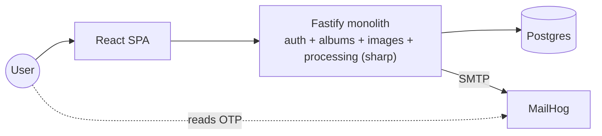
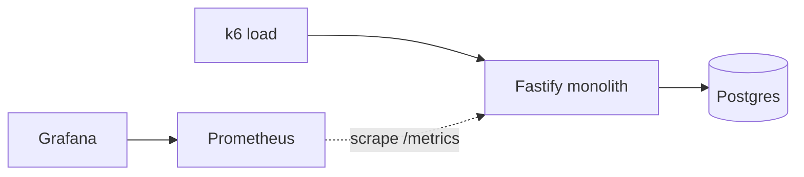
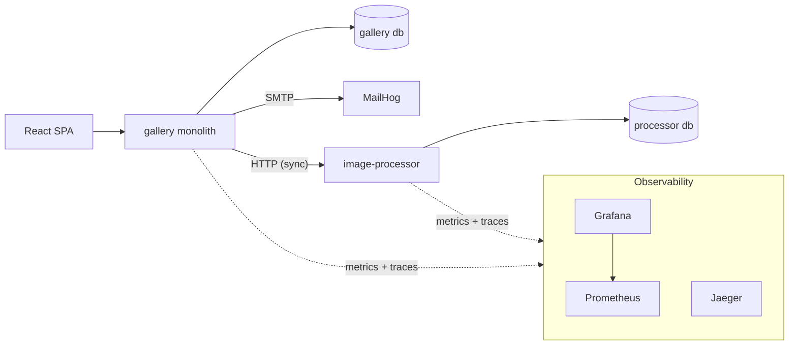
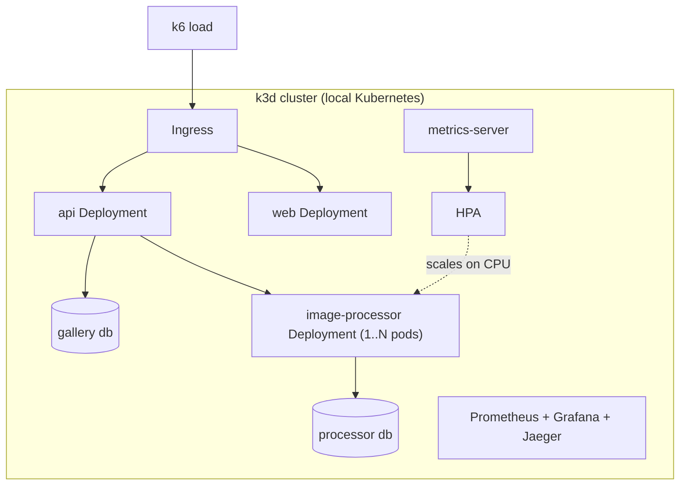
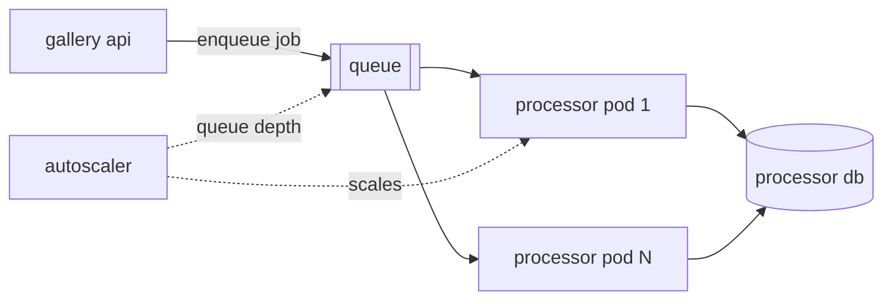
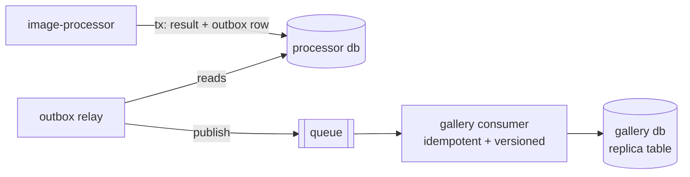
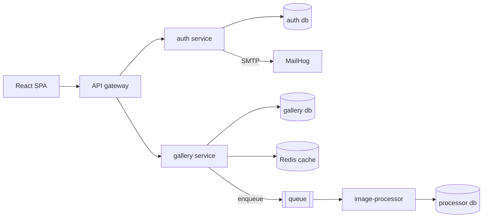

# SnapScale — Architecture

> What exists, how the parts relate, and how the topology evolves phase by phase.
> Concrete stack versions, API contracts, and schemas live in `03-technical-design.md`;
> the task breakdown lives in `04-implementation-plan.md`; the vision and phase goals
> live in `00-initial-idea.md` and `01-prd.md`.

## 1. System context

One human actor (the developer wearing the "user" hat) drives a browser SPA against a
backend that runs **entirely on the local machine**. No cloud account exists. Every
cloud concept in this lab is reproduced with an open tool that runs in a container —
the AWS mapping in §8 is part of the lesson.

Two workload types shape everything:

- **I/O-bound traffic** — auth, album/image CRUD. Cheap per request; suffers only when
  the process is starved by something else.
- **CPU-bound traffic** — image processing (`sharp`). Expensive per request; saturates
  the Node process and drags every other route down with it. This asymmetry is the
  engine of the whole project: it is what gets measured, extracted, and scaled.

## 2. Architectural rules

1. **Real microservice or nothing.** A service owns its database, its container image,
   and its lifecycle. It can be deployed, killed, and scaled without any other service
   changing. No service ever reads another service's tables.
2. **Shared packages ≠ shared state.** TypeScript packages in the monorepo (types,
   validation schemas, OTel bootstrap) are *code reuse at build time* — each service
   compiles its own copy. Coupling means *runtime dependence* (shared DB, shared
   filesystem, shared memory). The first is encouraged; the second is forbidden.
3. **No shared filesystem across service boundaries.** Image bytes cross a boundary
   inside a payload or via a fetch URL — never via a volume two services both mount.
4. **What crosses boundaries: IDs and events, never rows.** Services exchange
   identifiers and job/result messages; each side resolves them against its own store.
5. **OTel from day 1.** Every service is born instrumented. Observability *backends*
   arrive per phase; instrumentation is never retrofitted.

## 3. Topology evolution

### Phase 1 — Monolith (`phase-1-monolith`)

Everything in one Fastify process: OTP auth, album/image CRUD, and the heavy
processing route. One Postgres. MailHog catches OTP emails. Original and processed
images sit on a local volume owned by the monolith.

### Phase 2 — Observability (`phase-2-observability`)

Topology unchanged; a **metrics pipeline** appears beside it. Prometheus scrapes the
monolith; Grafana dashboards break latency/throughput down per route; k6 generates
load. Exit evidence: the dashboard isolating `/images/process` as the culprit.

### Phase 3 — Extraction (`phase-3-microservice`)

`image-processor` becomes a real service: own container, own Postgres (job and result
records), own lifecycle. The monolith calls it **synchronously over HTTP** — the
deliberately naive first cut whose failure modes justify phases 5–6. The **traces
pipeline** (Jaeger) lands here, because a trace crossing two services is where tracing
starts paying rent.

### Phase 4 — Autoscaling (`phase-4-autoscaling`)

Same services, new substrate: a local **k3d** Kubernetes cluster. Each service becomes
a Deployment + Service; the processor gets an **HPA** fed by **metrics-server**,
scaling on CPU. k6 pushes load; pods go 1→N and back.

### Phase 5 — Queue (`phase-5-queue`)

The sync HTTP hop is replaced by a **queue** (RabbitMQ — rationale in
`05-decision-log.md`). The monolith enqueues a job and answers immediately; processor
pods consume at their own pace. Autoscaling switches from CPU to **queue depth** — the
metric that actually expresses backlog.

### Phase 6 — Data sync (`phase-6-data-sync`)

Two databases now hold related data, and that data must stay consistent **through
outages**. Each piece of data gets one owner; other services hold read-only replicas
fed by events. The processor owns processing results; the gallery keeps a local replica
of processed-image metadata so reads never call the processor.

The machinery is the **transactional outbox**: the owner writes the business change and
the event in the *same local transaction* (killing the dual-write bug), a relay
publishes outbox rows to the queue, and consumers apply them **idempotently** (dedupe by
event id) with **per-record versions** (an older event never overwrites newer data).
Durable queues make outage recovery automatic: a dead consumer's backlog waits, and on
restart it drains in order — no loss, convergence guaranteed.

### Phase 7 — Resilience (`phase-7-resilience`)

Topology unchanged; the **failure path** gets architecture. A circuit breaker wraps the
monolith's edge toward the processor (the enqueue/dispatch point), with timeouts and
bounded retries. Exit evidence: processor killed, gallery CRUD stays green.

### Phase 8 — Cache (`phase-8-cache`)

**Redis** sits in front of processing, keyed by image + transformation identity. A hit
skips the processor entirely; the Grafana graph of processor load visibly collapses.

### Phase 9 — Gateway (`phase-9-gateway`)

Auth leaves the monolith: an **auth service** owns identities and OTP codes in its own
DB. A **gateway** becomes the single entry point — routing, rate limiting, central
token validation. The monolith is now just the **gallery service**.

## 4. Service boundaries and data ownership

| Service | Exists from | Owns | Never does |
|---|---|---|---|
| gallery monolith → gallery service | phase 1 | users*, albums, image metadata, original image files; gallery db. Holds a **read-only replica** of processed-image metadata from phase 6 | run `sharp` after phase 3; touch processor db; write to its replica outside the event consumer |
| image-processor | phase 3 | processing jobs, processed artifacts; processor db. **Source of truth** for processing results, replicated outward via outbox events from phase 6 | read gallery tables; share a volume with the gallery |
| auth service | phase 9 | identities, OTP codes, token issuance; auth db | expose gallery data |
| gateway | phase 9 | routing, rate limits, token validation | own business data (stateless) |

\* users move from the gallery db to the auth db in phase 9 — that migration reuses the
phase-6 replication machinery, and is part of the phase-9 lesson.

Boundary-crossing payloads: job requests (image reference/bytes + transformation
params), job results (artifact reference + status), and IDs. Anything richer is a smell.

## 5. Communication evolution

| Phase | Gallery → Processor | Why it changes |
|---|---|---|
| 1–2 | in-process function call | it's a monolith |
| 3–4 | sync HTTP request/response | simplest possible extraction; couples availability and latency — on purpose |
| 5+ | async job via queue | processing doesn't need to be synchronous; queue absorbs bursts and its depth becomes the scaling signal |
| 6+ | result data flows back as outbox events → idempotent, versioned consumers | replicas across DBs stay consistent through outages; reads decouple from the owner's availability |
| 7+ | same + circuit breaker, timeout, bounded retry at the dispatch edge | failure isolation: processor death must not cascade |
| 8+ | cache lookup short-circuits dispatch | repeat work is the cheapest work to eliminate |
| 9+ | all ingress via gateway | one place for routing, rate limits, authn |

## 6. Observability architecture

Every service embeds the OTel SDK from birth (shared bootstrap package). Pipelines
attach per phase:

| Signal | Backend | From | Answers |
|---|---|---|---|
| Metrics | Prometheus (scrape) + Grafana (dashboards) | phase 2 | "how much, how often, how slow — per route, over time" |
| Traces | Jaeger | phase 3 | "inside this one request, where did the time go — across services" |

Metrics prove *that* `/images/process` degrades the system; traces show *where* a
single request burns its time (handler vs DB vs `sharp` vs network hop). k6 is the
load source that makes both worth watching.

## 7. Kubernetes topology (phase 4+)

- **k3d** — k3s-in-Docker; the lightest local cluster that behaves like real k8s.
- One **Deployment + Service** per app (web, api, image-processor; later auth, gateway).
- **metrics-server** feeds the **HPA**; the HPA targets only the processor (CPU-based
  in phase 4, queue-depth-based in phase 5).
- Databases run as single-replica StatefulSets with local volumes — enough for a lab;
  their scaling is explicitly not this project's lesson.
- Observability stack runs inside the cluster; Grafana/Jaeger UIs exposed via ingress.

## 8. AWS mapping — the point of the lab

| Local tool | AWS equivalent | Lesson |
|---|---|---|
| Prometheus + Grafana | CloudWatch Metrics + Dashboards | per-route metrics expose the culprit |
| Jaeger | X-Ray | distributed traces explain *where* time goes |
| OTel SDK | ADOT (AWS Distro for OpenTelemetry) | same instrumentation, any backend |
| k3d cluster | EKS | same k8s API, zero cloud bill |
| HPA + metrics-server | ECS Service Auto Scaling / EKS HPA | scale on observed pressure |
| Queue (phase 5) | SQS | backlog as a first-class signal |
| Outbox + event replication (phase 6) | DynamoDB Streams / EventBridge | cross-service data consistency without distributed transactions |
| Redis cache | ElastiCache | cheapest request is the one not made |
| MailHog | SES sandbox | outbound email without outbound email |
| Gateway (phase 9) | API Gateway | one front door: routing, rate limits, authn |
| Postgres containers | RDS | managed vs self-run, same engine |
